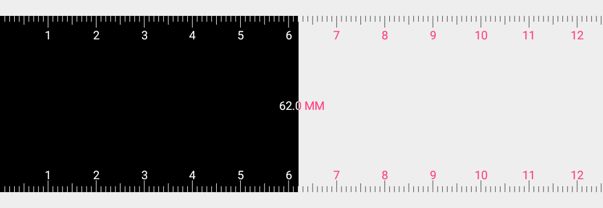
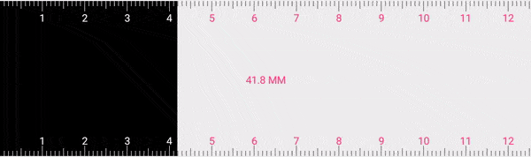
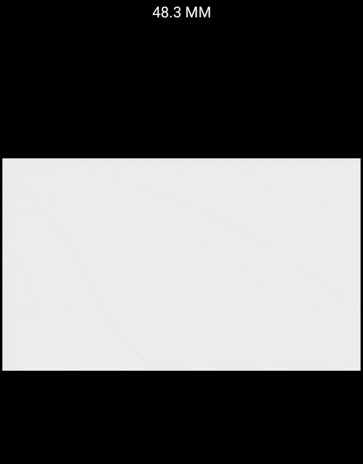

# RulerView
simple **Ruler** library response to user's actions give you **accurate measurement** in _millimeter_, with Calibration and Dimension measurement for Android, [see project on GitHub](https://github.com/anastr/RulerView/).

`minSdkVersion=15`

Library Size just ~ 18 KB.

[](#)
[](https://bintray.com/anastr/maven/RulerView)

<br/>


# Download

> soon


# Simple Usage
add RulerView to your `Layout.xml`.<br>
```xml

<com.github.anastr.rulerview.RulerView
        android:id="@+id/rulerView"
        android:layout_width="match_parent"
        android:layout_height="150dp" />

```

and that's it!!



you can get the length in _millimeter_ simply By
```kotlin
val length = rulerView.getDistance()
```

you can change the unit using this method
```kotlin
rulerView.unit = RulerUnit.IN // in inch
```

### Calibration

in android devices, convert pixels to (MM, IN...) is not always accurate.<br/>
you need your users help to calibration RulerView for there devices, that's why you should use `RulerCalibrationView` to do that.


the user can easily slide to match real measurements.

to use that, add `RulerCalibrationView` to your `layout.xml`
```xml
<com.github.anastr.rulerview.RulerCalibrationView
        android:id="@+id/rulerCalibrationView"
        android:layout_width="match_parent"
        android:layout_height="100dp" />
```

then you can get the **coefficient** and save it, then pass it to RulerView
```kotlin
// coefficient is a float number
val myCoefficient = rulerCalibrationView.coefficient
// save it somewhere (SharedPreferences maybe)
saveNumber(myCoefficient)

...

// pass it to your ruler
rulerView.coefficient = myCoefficient
```

### OneDimensionRulerView

to measure distance between two lines



```xml
<com.github.anastr.rulerview.OneDimensionRulerView
        android:id="@+id/oneDimensionRulerView"
        android:layout_width="match_parent"
        android:layout_height="match_parent" />
```

```kotlin
// return distance in Unit you have set
val distance = oneDimensionRulerView.getDistance()
```


## TODO
* add control on marks color
* text color
* text size
* add marks to OneDimensionRulerView
* new TwoDimensionRulerView

# LICENSE
```

Copyright 2016 Anas Altair

Licensed under the Apache License, Version 2.0 (the "License");
you may not use this file except in compliance with the License.
You may obtain a copy of the License at

    http://www.apache.org/licenses/LICENSE-2.0

Unless required by applicable law or agreed to in writing, software
distributed under the License is distributed on an "AS IS" BASIS,
WITHOUT WARRANTIES OR CONDITIONS OF ANY KIND, either express or implied.
See the License for the specific language governing permissions and
limitations under the License.

```
